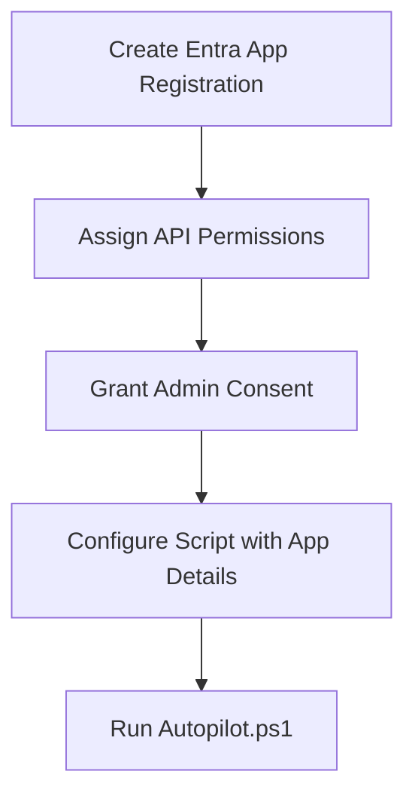

# Autopilot HWID Import Script

This PowerShell script automates the collection and import of Windows Autopilot hardware IDs (HWIDs) directly into Microsoft Intune using a registered application.

---

## Features
- Collects device hardware hashes
- Uploads HWIDs to Intune Autopilot service
- Supports group tagging for device assignment

---

## Prerequisites
- Windows 10/11 with PowerShell 5.1 or later
- Internet access
- Permissions to install PowerShell scripts from PSGallery
- Entra (Azure AD) App Registration with required API permissions

---

## Entra App Registration & Permissions

1. **Register a new application** in Entra (Azure AD):
    - Go to **Azure Portal** > **Entra ID** > **App registrations** > **New registration**
    - Name: `Import HWIDs` # You can choose whatever name you like
    - Redirect URI: Not required for this script

2. **Add API Permissions** (Microsoft Graph, Application type):

    - `DeviceManagementApps.ReadWrite.All`
    - `DeviceManagementConfiguration.ReadWrite.All`
    - `DeviceManagementManagedDevices.PrivilegedOperations.All`
    - `DeviceManagementManagedDevices.ReadWrite.All`
    - `DeviceManagementServiceConfig.ReadWrite.All`
    - `Directory.Read.All`
    - `Group.ReadWrite.All`

3. **Grant admin consent** for the permissions above.

4. **Create a client secret** and note the value (AppSecret).

5. **Collect the following details** for script configuration:
    - Tenant ID
    - Application (Client) ID
    - Application Secret
    - (Optional) Group Tag for device assignment

---

## Setup Flow



---

## Script Usage

1. **Edit `Autopilot.ps1`**
    - Replace `<TenantId>`, `<AppId>`, `<AppSecret>`, and `<GroupTag>` with your values.
    - Remove the `-GroupTag` line if not using group tags.

2. **Run PowerShell as Administrator**

3. **Execute the script:**
    ```powershell
    .\Autopilot.ps1
    ```

---

## Notes
- The script will install the required `Get-WindowsAutopilotInfo` module if not present.
- Ensure your account has permission to register devices in Intune.
- For troubleshooting, see the [official Microsoft documentation](https://docs.microsoft.com/mem/autopilot/add-devices). 